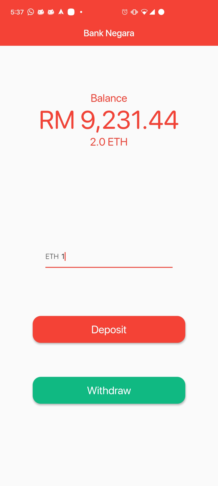
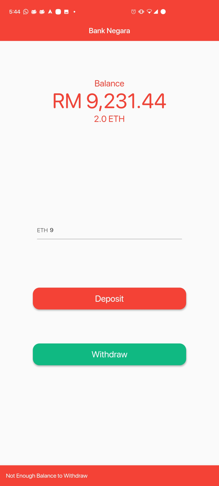

# Bank-Negara-Flutter

A flutter Application for the [Bank Negara Decentralized](https://github.com/Blacksuan19/Bank-Negara-Dapp) App.

## Requirements

- [Flutter](https://flutter.dev/)

## Platforms

- tested on Android and Linux.
- to enable linux support on your installation check [this guide](https://flutter.dev/desktop)
- Web should also work fine.

## Development

- install Flutter and any reqirements for respective platform.
- `flutter run -d device` to run application on `device`

## Screenshots

### Customer UI

### withdraw sneakbar

also different DPI

