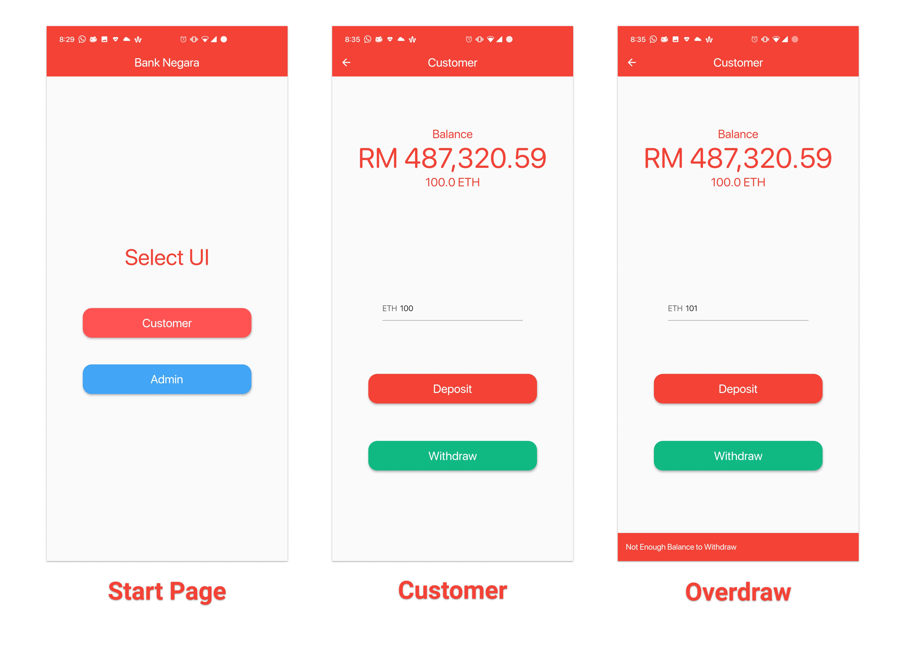
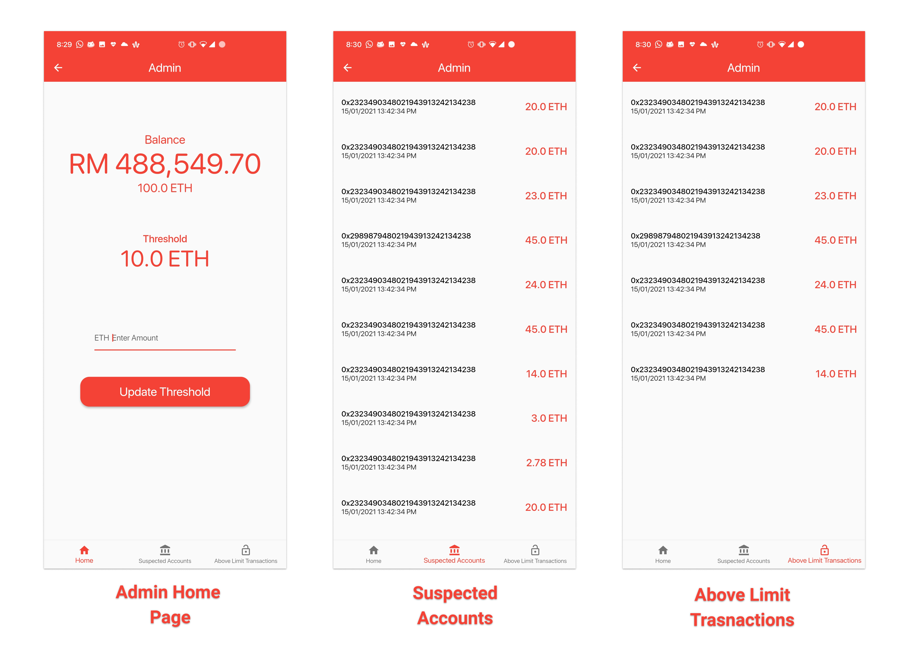

# Bank-Negara-Flutter

A flutter Application for the [Bank Negara Decentralized](https://github.com/Blacksuan19/Bank-Negara-Dapp) App.

## Requirements

- [Flutter](https://flutter.dev/)

## Platforms

- tested on Android and Linux.
- to enable linux support on your installation check [this guide](https://flutter.dev/desktop)
- Web should also work fine.

## Development

- install Flutter and any requirements for respective platform.
- `flutter run -d device` to run application on debug mode on `device`
- run `flutter build apk --split-per-abi` to build android apk file.
- prebuilt apks for all 3 major archs can be found in the apk folder.

## Screenshots

